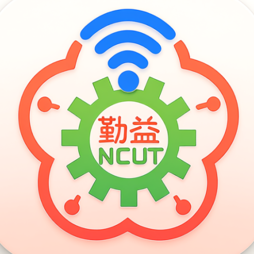

# NCUT 校園網路

連上校園網路後，自動完成登入。網路需要重新認證時，自動恢復連線。

## 下載與安裝

前往 [最新版本](https://github.com/apple050620312/NCUTInternetAutoLogin/releases/latest)，
選擇你的裝置。每個平台只有一個安裝檔，不需要解壓縮。

| 裝置 | 下載檔案 | 安裝方式 |
| --- | --- | --- |
| Windows | `NCUT-Windows.exe` | 開啟檔案，依安裝精靈完成安裝 |
| OpenWrt 路由器（25.12+） | `NCUT-OpenWrt.apk` | SSH 執行 `apk add --allow-untrusted /tmp/NCUT-OpenWrt.apk` |
| OpenWrt 路由器（24.10 或更早） | `NCUT-OpenWrt.ipk` | 在路由器「系統 → 軟體」上傳安裝 |
| Linux | `NCUT-Linux.AppImage` | 允許檔案執行，再開啟 |
| Android | `NCUT-Android.apk` | 開啟檔案，允許此來源安裝 |
| macOS | `NCUT-macOS.dmg` | 開啟後將 App 拖入「應用程式」 |

## 開始使用

1. 連上勤益校園 Wi-Fi 或有線網路。
2. 輸入校園帳號與密碼，儲存設定。
3. 開啟「自動重新連線」，或按「立即連線」。

桌面版可以選擇「登入電腦時啟動」。關閉視窗後仍會在背景保持連線；
從系統匣選單可以重新開啟、暫停或結束。

Android 開啟自動連線時會顯示連線通知，也可以直接從通知暫停。
請允許通知；部分手機的省電設定可能限制背景連線。

路由器的帳號設定與操作方式請參考 [OpenWrt 使用說明](OpenWrt/README.md)。
僅有終端機的裝置可使用 [CLI 版本](CLI/README.md)。

## 連線狀態

「網路已連線」表示網際網路連線檢查成功。若顯示「登入未完成」，請確認帳號密碼；
若顯示「等待網路連線」，請先確認 Wi-Fi 或網路線。
連線紀錄可以查看最近的狀態變化，不會顯示密碼。

更新 App 後，原有設定會保留。從舊版首次換到新版時，請先停用舊版自動登入，
再於新版重新輸入帳號，避免同時登入。

## 專案

桌面版集中於 `Desktop/`，手機版於 `Android/`，路由器版於 `OpenWrt/`。
共用內容於 `Core/`，終端機版本於 `CLI/`。
[開發與建置](docs/DEVELOPMENT.md) · [重構進度](docs/REFACTOR_PLAN.md)

作者：sangege。感謝 hongfu553、AILIFE-4798、rileychh 與原專案貢獻者。
Logo 來自 [AI LIFE Android 專案](https://gitlab.com/ailife8881/ncut-internet-auto-login-android/)。
另有 [localhost C++ Win32 版本](https://github.com/ben001109/NCUT-Internet-Auto-Login-CPP)。
延續原專案 MIT 授權。

聯絡：[Discord](https://discord.com/users/523114942434639873) · [Email](mailto:apple050620312@gmail.com)
